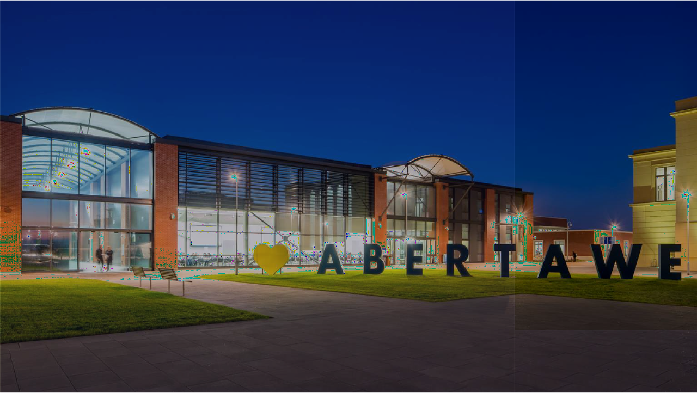

---
jupytext:
  formats: md:myst,ipynb
  text_representation:
    extension: .md
    format_name: myst
    format_version: 0.13
    jupytext_version: 1.15.2
kernelspec:
  display_name: Python 3 (ipykernel)
  language: python
  name: python3
---

+++ {"editable": true, "slideshow": {"slide_type": "slide"}}

(welcome)=

# Croeso i Brifysgol Abertawe | Welcome to Swansea University

## EG-151 Microcontrollers



+++ {"slideshow": {"slide_type": "slide"}}

(welcome:module_staff)=

## Module Staff

+++ {"slideshow": {"slide_type": "slide"}}

(welcome:staff:chris)=

### Dr Chris Jobling

```{image} pictures/chris.jpg
:alt: A photograph of Dr Chris Jobling
:width: 25%
```

**Module Coordinator**

**Email**: [c.p.jobling@swansea.ac.uk](mailto:c.p.jobling@swansea.ac.uk)

**Office Hour**: Tuesdays 13:00 on Zoom. (From Monday 8th October)

**Office Location**: Room B206, Engineering East

+++ {"slideshow": {"slide_type": "slide"}}

(welcome:staff:hayder)=

### Dr Hayder Jahanger

```{image} pictures/jahanger.png
:alt: A photograph of Dr Hayder Jahanger
:width: 25%
```

**Module Lecturer**

**Email**: [hayder.jahanger@swansea.ac.uk](mailto:hayder.jahanger@swansea.ac.uk)

**Office Hour**: TBC

**Office Location**: Room 202, Engineering North

+++ {"slideshow": {"slide_type": "slide"}}

(welcome:staff:ben)=

### Dr Ben Clifford

```{image} pictures/ben.png
:alt: A photograph of Dr Ben Clifford
:width: 35%
```

**Guest Lecturer** Ben wrote the original lecture notes.

+++ {"slideshow": {"slide_type": "slide"}}

(welcome:staff:timothy)=

### Dr Timothy Davies

```{image} pictures/tim.jpg
:alt: A photograph of Dr Timothy Davies
:width: "35%"
```

**Guest Lecturer** Timothy developed the laboratory exercises and the mini project.

[t.davies@swansea.ac.uk](mailto:t.davies@swansea.ac.uk)

+++ {"slideshow": {"slide_type": "slide"}}

(welcome:course_site)=

## Course Site

The home page for this course is "2425_EG-151_Microcontrollers" on your Canvas dashboard

```{image} pictures/image8.png
:alt: The course entry page on Canvas dashboard
:width: 100%
```

[canvas.swansea.ac.uk/courses/44971](https://canvas.swansea.ac.uk/courses/44971)

+++ {"slideshow": {"slide_type": "slide"}}

(welcome:course_delivery)=

## Course Delivery

- Lecture Class

  - Tuesday 11:00 &ndash; 11:50

  - Y Twyni, Room 105

+++ {"slideshow": {"slide_type": "fragment"}}

- Laboratory class

  - 10:00 &ndash; 12:00 Thursday and Friday

  - Engineering East, Room B107 Electronics Lab

+++ {"slideshow": {"slide_type": "fragment"}}

- Self Directed Learning (50 Hours over 10 Weeks)

  - Review lecture material and supporting content

  - Online activities including quizzes and discussion forums

+++ {"slideshow": {"slide_type": "slide"}}

(welcome:course_overview)=
## Course Overview

This course is made up of lectures which introduce the basics of microcontroller architecture and operation,and how they are programmed

+++ {"slideshow": {"slide_type": "slide"}}

### Course syllabus

Applications of microcontrollers, and programming in both assembly and 'C' languages.The lectures will be supported by a series of practical sessions where you will learn how to implement the lecture content to commission simple programs on an Arduino microcontroller.

+++ {"jp-MarkdownHeadingCollapsed": true, "slideshow": {"slide_type": "slide"}}

### Key Topics

- Microcontroller fundamentals and architecture.

- Microcontroller programming: instruction execution; basic instructions.

- Software design and development tools.

- Assembly and C programming languages,

+++ {"slideshow": {"slide_type": "slide"}}

(welcome:course_assessment)=

### Course Assessment

There are four formal assessment components to this course:

+++ {"slideshow": {"slide_type": "fragment"}}

1. **Lab introduction exercise** &ndash; 15%

    - During the first four weeks of term, the laboratory will be used
        for a laboratory introduction exercise covering health and
        safety, a breadboard construction exercise, a simulation
        exercise and a soldering exercise.The laboratory introduction is
        COMPULSORY and must be passed if a student is to work in the
        laboratory.

+++ {"slideshow": {"slide_type": "fragment"}}

2. **Five short 'C' language programming exercises** &ndash; 20% (4% each)

    - An example program will be provided which students are expected
        to modify so as it performs the required functions. The 5
        exercises involve creating a binary counter, reading a digital
        input, reading an analogue input and working with arrays, and writing information to an LCD display device.
        Assessment will be through submission of a lab diary containing
        the modified and commented code, a flow chart and a description
        of the changes made. Submission will be through the Canvas
        platform.

+++ {"slideshow": {"slide_type": "fragment"}}

3. **A mini project** &ndash; 30%

    - The mini project will require each student to create a program
        to achieve a certain task making use of the knowledge gained
        during the lectures and four lab exercises. Assessment will be
        through submission of a lab diary containing the modified and
        commented code, a flow chart and a description of the changes
        made. Submission will be through the Turnitin platform.

+++ {"slideshow": {"slide_type": "fragment"}}

4. **Formal Class Test**  &ndash; 35%

    - The class test will be online and based on content covered in the
        lectures and laboratory sessions.These questions will be similar
        to those presented in each weekly quiz. For the practical
        assessment marks to count, you must achieve at least 40% in the
        Formal Test.You will have one attempt to redeem a failure before
        the end of semester 1. If you achieve less than 40% after this,
        then the course mark will be just the Class Test mark and you
        will be required to sit a supplementary exam in August.

+++ {"slideshow": {"slide_type": "fragment"}}

**Additionally, to be allowed a supplementary examination for this course you must have an 80% attendance rate in laboratory classes**.
