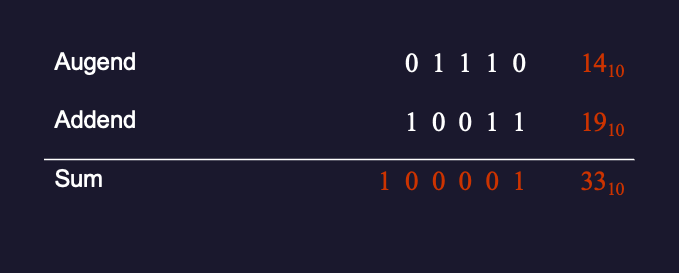
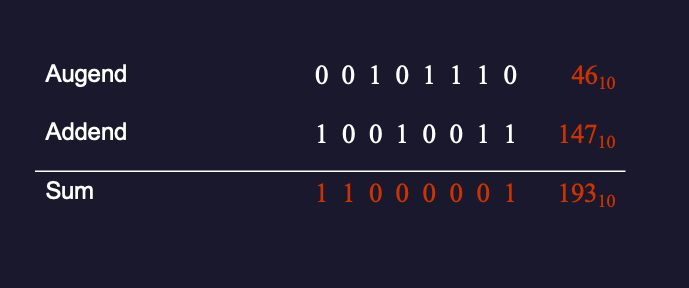
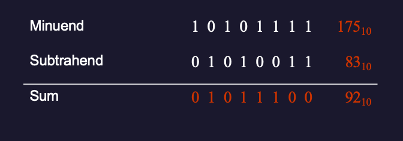

(week2)=
# Introduction to Data Representation


(week2:introduction)= 
## Introduction

The week's lecture provides a background to data representation introducing some of the different terminologies used such as 'bit', 'byte', and 'word' before looking at different numbering systems, including binary and hexadecimal, that are used in computing and microcontrollers. The presentation covers a number of methods such as exponentiation and divide-by-n which can be used to convert between number bases and finishes with looking at how microcontrollers perform addition and subtraction. 


(week2:toc)=
## Topics Covered in this Lecture

- {ref}`week2:intro2dr`
- {ref}`week2:numbering`
- {ref}`week2:addition_and_subtraction`


(week2:intro2dr)=
## Introduction to Data Representation

### How is Data stored Digitally?

Modern digital processors and microcontrollers contain millions of solid state devices known as transistors ({numref}`fig:week2:transistor`).

```{figure} pictures/transistor.png
:name: fig:week2:transistor
:width: 30%
:alt: A single transistor

A single transistor
```


With one transistor  we can control the
flow of electrons creating an object with two states &ndash; on or off.
This is known as a binary system.

We can use the output (or input if wired to ground) of this transistor
to connect to other transistors forming logic gates and eventually a bit of memory.

With many transistors we can use these transistors to create memory and store data as bits ({numref}`fig:week2:1_bit_of_memory`).

```{figure} pictures/memory.jpg
:alt: One bit of SRAM memory.
:name: fig:week2:1_bit_of_memory
:width: 50%

One bit of SRAM memory. (Image source: [SRAM vs DRAM : How SRAM Works? How DRAM Works? Why SRAM is faster than RAM?](https://youtu.be/r787m_IaR1I), All About Electronics - YouTube.)
```


### Terminology

**1 bit = 1 data unit**


**1 nybble = 4 data units (4 bits)**


**1 byte = 8 data units (8 bits, 2 nybbles)**


**1 word = 16 data units (16 bits, 2 bytes, 4 nybbles)**


(week2:numbering)=
## Numbering Systems and Base Conversion


### Decimal Number Representation

Take the decimal number (Base 10) 4623, what does this representation mean?

$$4623$$

$$4000 + 600 + 20 + 3$$

$$(4\times 1000) + (6\times 100) + (2\times 10) + (3\times 1)$$ 

$$\left(4\times 10^3\right) + \left(6\times 10^2\right) + \left(2\times 10^1\right) + \left(3\times 10^0\right)$$

We can break down any base 10 (decimal) number $N$ in the same way using the expression:

$$N_{10} = \cdots  + \left(X\times 10^3\right) + \left(X\times 10^2\right) + \left(X\times 10^1\right) + \left(X\times 10^0\right)$$

where $X$ is any *digit* in the set $\{0, 1, 2, 3, 4, 5, 6, 7, 8, 9\}$.


### What About Other Bases?

We can apply the same techniques to any other base to convert the value into decimal (base 10).

For programming (and digital systems more generally), the binary (base 2), octal (base 8) and hexadecimal (base 16) representations are commonly used.


#### Binary (base 2)

$$N_2 = \cdots + \left(X\times 2^5\right) + \left(X\times 2^4\right) + \left(X\times 2^3\right) + \left(X\times 2^2\right) + \left(X\times 2^1\right) + \left(X\times 2^0\right)$$

where $X$ is any digit in the set $\{0, 1\}$.


##### Example 1

Consider the binary representation $N_2 = 10010011$. What is the value of $N_2$ in decimal base 10?


###### Solution

$$N_{10} = \left(1\times 2^7\right) + \left(0\times 2^6\right) + \left(0\times 2^5\right) + \left(1\times 2^4\right) + \left(0\times 2^3\right) + \left(0\times 2^2\right) + \left(1\times 2^1\right) + \left(1\times 2^0\right)$$

$$N_{10} = \left(1\times 128\right) + \left(0\times 64\right) + \left(0\times 32\right) + \left(1\times 16\right) + \left(0\times 8\right) + \left(0\times 4\right) + \left(1\times 2\right) + \left(1\times 1\right)$$

$$N_{10} = 128 + 16 + 2 + 1$$

$$N_{10} = 147_{10}$$


#### Octal (base 8)

Octal:

$$N_{8} = \cdots  + \left(X\times 8^5\right) + \left(X\times 8^4\right) + \left(X\times 8^3\right) + \left(X\times 8^2\right) + \left(X\times 8^1\right) + \left(X\times 8^0\right)$$

where $X$ is any *digit* in the set $\{0, 1, 2, 3, 4, 5, 6, 7\}$.


##### Example 2

Consider the octal representation $N_8 = 712$. What is the value of $N_8$ in decimal base 10?


###### Solution

$$N_8 = 713$$

$$N_{10} = \left(7\times 8^2\right) + \left(1·8^1\right) + \left(2·8^0\right)$$

$$
\begin{align}
N_{10} &= (7\times 64) + (1\times 8) + (2\times 1)\\
&= 448 + 8 + 2\\
&= 45810
\end{align}
$$


#### Hexadecimal (base 16)

$$N_{16} = \cdots  + \left(X\times 16^5\right) + \left(X\times 16^4\right) + \left(X\times 16^3\right) + \left(X\times 16^2\right) + \left(X\times 16^1\right) + \left(X\times 16^0\right)$$

where $X$ is any *digit* in the set $\{0, 1, 2, 3, 4, 5, 6, 7, 8, 9, \textrm{A}, \textrm{B}, \textrm{C}, \textrm{D}, \textrm{E}, \textrm{F}\}$[^hex_digits].

[^hex_digits]: Note we have to introduce the letters A-F to represent the two-digit decinal numbers 10-15. Thus $\textrm{A}_{16} = 10_{10}$, $\textrm{B}_{16} = 11_{10}$, $\textrm{C}_{16} = 12_{10}$, $\textrm{D}_{16} = 13_{10}$, $\textrm{E}_{16} = 14_{10}$, $\textrm{F}_{16} = 15_{10}$, 


##### Example 3

Consider the hexadecimal representation $N_{16} = 3\textrm{C}4$. What is the value of $N_{16}$ in decimal base 10?


###### Solution

$$N_{16} = \left(3\times 16^2\right) + \left(\textrm{C}\times 16^1\right) + \left(4\times 16^0\right)$$

$$
\begin{align}
N_{10} &= 3\times 256 + 12\times 16 + 4\times 1\\
&= 768 + 192 + 4\\
&= 96410
\end{align}
$$


### Decimal Number Conversion

A decimal number can be converted into any other base using the **divide-by-$n$** method where $n$ represents the desired base.

Step 1 (see {numref}`divide-by-n-method` − Divide the decimal number by the value of the new base and get the quotient and a remainder. 

Step 2 − Keep dividing the quotient of the previous divide by the new base and record the remainder.

Step 3 − Repeat Step 2, until the quotient becomes zero.

Step 4 -- Read the remainders from bottom (MSB) to top (LSB).

```{figure} pictures/dividion_method.png
:alt: Illustration of a step in the divisision-by-n method of decimal number conversion.
:name: divide-by-n-method
:width: 60%

a step in the divisision-by-$n$ method of decimal number conversion.
```


#### Example 4

Convert $28_{10}$ into binary (base 2).


##### Solution

Step 1: $28 \div 2 = 14$ remainder $0$

Step 2: $14 \div 2 = 7$ remainder $0$

Step 3: $7 \div 2 = 3$ remainder $1$

Step 4: $3 \div 2 = 1$ remainder $1$

Step 5: $1 \div 2 = 0$ remainder $1$

Binary value: $28_{10} = 11100_{2}$.


##### Confirmation

$$\begin{align}
11000_2 &= \left(1\times 2^4\right) + \left(1\times 2^3\right) + \left(1\times 2^2\right) + \left(0\times 2^1\right) + \left(0\times 2^0\right)\\
&= \left(1\times 16\right) + \left(1\times 8\right) + \left(1\times 4\right) + \left(0\times 2\right) + \left(0\times 1\right)\\
&= 16 + 8 + 4\\
&= 28_{10}
\end{align}
$$


#### Example 5

Convert $28_{10}$ into octal (base 8).


##### Solution

Step 1: $28 \div 8 = 3$ remainder $4$

Step 2: $3 \div 8 = 0$ remainder $3$

Octal value: $28_{10} = 34_{8}$.


##### Confirmation

$$\begin{align}
34_8 &= \left(3\times 8^1\right) + \left(4\times 8^0\right)\\
&= \left(3\times 8\right) + \left(4\times 1\right) \\
&= 24 + 4\\
&= 28_{10}
\end{align}
$$


#### Example 6

Convert $28_{10}$ into hexadecimal (base 16).


##### Solution

Step 1: $28 \div 16 = 1$ remainder $12\,\left(\textrm{C}_{16}\right)$

Step 2: $1 \div 16 = 0$ remainder $1$

Hexadecimal value: $28_{10} = 1\textrm{C}_{16}$.

##### Confirmation

$$\begin{align}
1\textrm{C}_{16} &= \left(1\times 16^1\right) + \left(\textrm{C}\times 16^0\right)\\
&= \left(1\times 16\right) + \left(12\times 1\right) \\
&= 16 + 12\\
&= 28_{10}
\end{align}
$$


### Tricks and Tips

All numbers are stored in a computer in binary form. Depending on the encoding, each digit takes up 1 (binary), 3 (octal) or 4 bits (decimal and hexadecimal).

If the digit needs less bits than allowed for its representation, the remaining bits the the left of the number will be set to zero. 

For example:

- $1_2$ is represented as `0b00000001`[^note2] (binary, prefix `0b`, seven padding 0 bits + 1 bit for the value 1).
- $5_8$ is `0005` (octal prefix `0` followed two 0 digits (2 bits plus 3 bits) (00 000 101).
- $10_{10} = 8 + 2$ is `0b00010010`.
- $\textrm{E}$ is `0x00E` (hexadecimal prefix `0x0` followed by `0b0000`, and `0b1110` = `0b00001110`).

For octal and hexadecimal values, the equivalent binary number is easily obtained by grouping from the right.

- For octal, the largest digit is 7 which needs three bits. So the octal representation of an 8 bit binary number will have 2 bits (0-3) + two groups of 3 bits. The maximum number allowed is `0b11 111 111` = `0377` = 255_{10}.
- For hexadecimal, four bits are needed to represent all values in the range 0-F. So an 8 bit value can only represent two hexadecimal digits `0x000` to `0x0FF`.

To convert a binary number to octal or heaxdecimal, just group the binary digits and then read off the value.


#### Example 7

Convert the binary number `0x000011101` to octal and hexadecimal. Give the value in decimal.


##### Solution

Grouping `0x000011101` by threes gives `00` + `011` + `101` = `0035` = $35_8$. 

Grouping `0x000011101` by fours gives `0001` + `1101` = `0x01D` = $1\textrm{D}_{16}$. 

Taking the octal value $62_8 = \left(0\times 8^2\right) + \left(3\times 8^1\right) + (5\times 8^0) = 0 + 24 + 5 = 29_{10}$.


#### Example 8

Convert the octal number $62_8$ (`0062`) to binary and hexadecimal. Give the value in decimal.


##### Solution

The octal digits $6_8$ and $2_8$ are the three-bit binary values  `0b110` and `0b010` respectively. So the equivalent 8-bit binary byte is obtained by combining these binary values and prepending with two zeros: `0b00 110 010` -> `0b00110010`. 

Grouping the binary number `0b00110010` in blocks of 4 gives `0b 0011 0010` which gives the hexdecimal digits  $3_{16}$ and $2_{16}$ respectively. So $62_8 = 32_{16}$.

The equivalent decimal number is $\left(3\times 16^1\right) + \left(2\times 16^0\right) = 48 + 2 = 50_{10}$.[^note3]

[^note2]: Here we are taking the opportunity to introduce the value notation that is used in the C and many other programming languages. Decimal numbers are written as they would be in normal usage: `10`, `100`, `255` etc. Binary numbers use the prefix `0b`: e.g. `0b10010`, `0b00010010`. Octal numbers use the prefix `0` and the digits 0-7: e.g. `0127`, `0377`, etc. Hexadecimal numbers use the prefix `0x0` and the digits 0-9 and A-F: e.g. `0x02B`, `0x019`.

[^note3]: The calculator app on both Windows and MacOS have a programmer view that makes it easy to confirm these results.


### Summary of number systems

{numref}`week2:table:number-values` shows the equivalent binary, octal and hexadecimal values for decimal numbers 0-16. Note that we need just 1 nybble to represent a value in the range 0-154 but we need two nybbles (1 byte) for numbers greater than 15. The maximum value representable in one byte of data is $2^8 - 1 = 255$. The concept can of course be extended to words (16 bits). The maximum value that can be represented with 16 bits is $2^{16} - 1 = 65,535$. 

```{list-table} Representation of integer values in 8 bit computer systems
:header-rows: 1
:name: week2:table:number-values

* - Decimal (Code)
  - Binary (Code)
  - Octal (Code)
  - Hexadecimal (Code)
* - $0$ (`0`)
  - $0$ (`0b00000000`)
  - $0$ (`000`)
  - $0$ (`0x00`)
* - $1$ (`1`)
  - $1$ (`0b00000001`)
  - $1$ (`001`)
  - $1$ (`0x01`)
* - $2$ (`2`)
  - $10$ (`0b00000010`)
  - $2$ (`002`)
  - $2$ (`0x02`)
* - $3$ (`3`)
  - $11$ (`0b00000011`)
  - $1$ (`003`)
  - $1$ (`0x03`)
* - $4$ (`4`)
  - $100$ (`0b00000100`)
  - $4$ (`004`)
  - $4$ (`0x04`)
* - $5$ (`5`)
  - $101$ (`0b00000101`)
  - $5$ (`005`)
  - $5$ (`0x05`)
* - $6$ (`6`)
  - $110$ (`0b00000110`)
  - $6$ (`006`)
  - $6$ (`0x06`)
* - $7$ (`7`)
  - $111$ (`0b00000111`)
  - $7$ (`007`)
  - $7$ (`0x07`)
* - $8$ (`8`)
  - $1000$ (`0b00001000`)
  - $10$ (`010`)
  - $8$ (`0x08`)
* - $9$ (`9`)
  - $1001$ (`0b00001001`)
  - $11$ (`011`)
  - $9$ (`0x09`)
* - $10$ (`10`)
  - $1010$ (`0b00001010`)
  - $12$ (`012`)
  - $\textrm{A}$ (`0x0A`)
* - $11$ (`11`)
  - $1011$ (`0b00001011`)
  - $13$ (`013`)
  - $\textrm{B}$ (`0x0b0000`)
* - $12$ (`12`)
  - $1100$ (`0b00001100`)
  - $14$ (`014`)
  - $\textrm{C}$ (`0x0C`)
* - $13$ (`13`)
  - $1101$ (`0b00001101`)
  - $15$ (`015`)
  - $\textrm{D}$ (`0x0D`)
* - $14$ (`14`)
  - $1110$ (`0b00001110`)
  - $16$ (`016`)
  - $\textrm{E}$ (`0x0E`)
* - $15$ (`15`)
  - $1111$ (`0b00001111`)
  - $17$ (`017`)
  - $\textrm{F}$ (`0x0F`)
* - $16$ (`16`)
  - $10000$ (`0b00010000`)
  - $20$ (`020`)
  - $10$ (`0x10`)
```


### Other binary encodings

Numbers are not the only type of data that can be encoded using binary values. In fact, all data that is manipulated by computers is represented by an encoding.

Some examples of codings that you will see are:

- Characters which are represented as ASCII code (7 bits), extended ASCII (8 bits) or UTF (16 or more bits) used to represent other characters (e.g. for accented charcters, other alphabets and languages, math symbols, emojis, and other purposes.
- Other numerical encodings, such as Binary Coded Decimal (BCD)
- Machine codes, which is how computers represent exercutable programmes, are also represented in binary numbers. These are usually generated by an assembler, compiler, or interpreter from human-readable code that is stored in text files that are themselves use characters encoded in ASCII or UTF.

Additional self-directed learning materials which explore some of these extra encodings are provided on Canvas. We will dicuss some of the encodings used for machine code in later lectures.


(week2:addition_and_subtraction)=
## Binary Addition and Subtraction

How do computers add and subtract numbers?


### Binary Arithmetic

Microcontrollers work with 0's and 1's (binary)

In order to add or subtract two binary numbers there are a series of rules similar to in decimal arithmetic.


#### Rules for Binary Addition

$$
\begin{align*}
0 + 0 &= 0\\
0 + 1 &= 1\\
1 + 0 &= 1\\
1 + 1 &= 10\quad\textrm{i.e.}\, 0 + \textrm{carry}\, 1
\end{align*}
$$


##### Example 10

Confirm using binary addition that $14_{10} + 19_{10} = 33_{10}$.


###### 
Solution




##### Example 11

Confirm using binary addition that $46_{10} + 147_{10} = 193$.


###### Solution




#### Rules for Binary Subtraction

$$
\begin{align*}
0 - 0 &= 0\\
1 - 0 &= 1\\
1 - 1 &= 0\\
0 - 1 &= 10 - 1 +\,\textrm{borrow} = 1+ \textrm{borrow}
\end{align*}
$$


##### Example 12

Confirm using binary subtraction that $27_{10} - 14_{10} = 13_{10}$. 


###### Solution


##### Example 13

Show using binary subtraction that $175_{10} - 83_{10} = 92_{10}$.


###### Solution




#### Binary Arithmetic and Flags

What happens when the result is larger than 8-bits?


##### Extended Rules for Binary Addition

We need to extend the rules of binary addition to introduce an overflow that is indicated by a carry flag.

$$
\begin{align*}
0 + 0 &= 0 \\
0 + 1 &= 1 \\
1 + 0 &= 1 \\
1 + 1 &= 10\quad \textrm{i.e.}\, 0 + \textrm{carry}\, 1 \\
1 + 1 + 1 &= 11\quad \textrm{i.e.}\, 1 + \textrm{carry}\, 1
\end{align*}
$$


(week2:example14)=
##### Example 14

Show using binary addition that $110_{10} + 227_{10} = 337_{10}$.


###### Solution


The overflow is acknowledged in the **status register** by the carry flag


#### Introduction to the Status Register

The microcontroller has an 8-bit register containing a number of flags which can be set based on the condition of the microcontroller.

The status register for the Atmel ATMega328/P is illustrated in {numref}`fig:week2:sr`.

```{figure} pictures/status_register.png
:name: fig:week2:sr
:align: center
:width: 100%
:alt: The Status Register of the Atmel ATMega328/P

The Status Register of the Atmel ATMega328/P
```

- The Half Carry Flag `H` is set (to 1) if there was a carry from bit 3; it is cleared (set to 0) otherwise.
- The Zero Flag `Z` is set if the result is `0x00000000`; cleared otherwise.
- The Carry Flag `C` is set if there was a carry from the most significant bit (MSB)[^mote:msb] of the result; cleared otherwise.

[^note:msb] The most significant bit is the left most bit. It corresponds to the numerical value $2^7 = 128$. For certain operations, it may also indicate a negative number.

We will look at the status register in detail in {ref}`week3`.

<!-- #region -->
#### Binary Arithmetic Example 14

{numref}`fig:week2:ex15` shows the condition of the status register after completing the addition from {ref}`week2:example14`.


```{figure} pictures/sr_after_ex14.png
:name: fig:week2:ex15
:align: center
:width: 100%
:alt: The condition of the status register after completing the sum 

The condition of the status register after completing the sum $110_{10} + 227_{10} = 337$.
```
<!-- #endregion -->

## Other Data Representations

We have provided notes and videos that introduce other commonly used data representations in {ref}`appendixa`. These notes are examinable, but we encourage you to study these for yourself.

```python

```

```python

```
