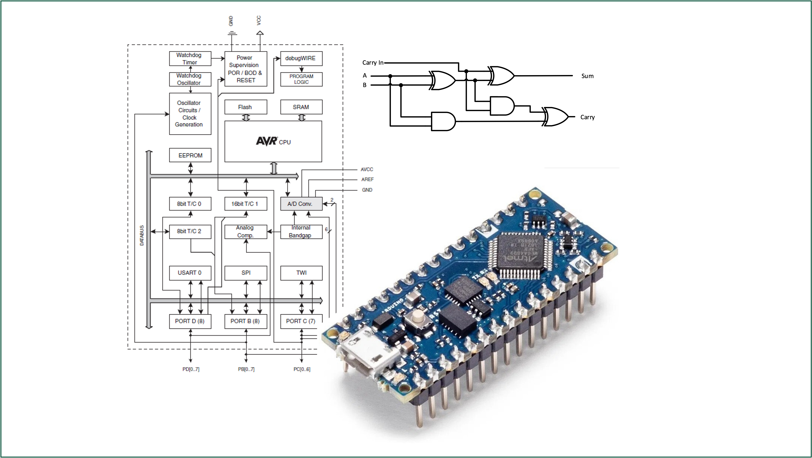
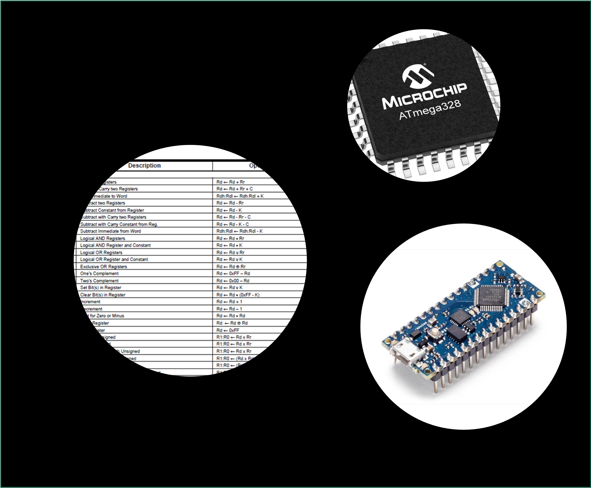

(week3)=
# Architecture of the Atmel ATmega 328 Microcontroller



<!-- #region -->
## Lecture Topics



- {ref}`week3:intro`
- {ref}`week3:status_register`
- {ref}`week3:program_counter`
- {ref}`week3:stack_pointer`
- {ref}`week3:io`


(week3:intro)=
## Introducing the Atmel ATmega 328 MCU

In {ref}`week1` we described what a microcontroller is and looked at how one can be described by considering its architecture. We finished the lecture looking at {numref}`week3:fig:atmel_arch` which provides an overview of the AVR core architecture and we introduced the general purpose registers and the ALU.


```{figure} pictures/atmel_arch.png
:name: week3:fig:atmel_arch
:align: center
:width: 100%
:alt: The architecture of the Atmel ATMega328 Microcontroller

The architecture of the Atmel ATMega328 Microcontroller
```

(week3:status_register)=
## The Status Register

(week3:program_counter)=
## The program counter

(week3:stack_pointer)=
## The Stack Pointer

(week3:io)=
## Introduction to Microcontroller I/O

<!-- #endregion -->

```python

```
