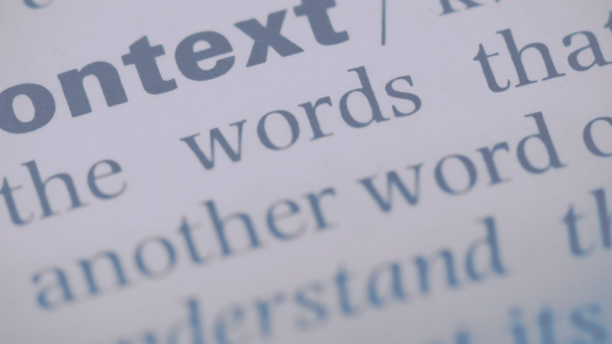

---
jupytext:
  formats: ipynb,md:myst
  text_representation:
    extension: .md
    format_name: myst
    format_version: 0.13
    jupytext_version: 1.15.2
kernelspec:
  display_name: Python 3 (ipykernel)
  language: python
  name: python3
---

+++ {"slideshow": {"slide_type": "slide"}}

(week4)=
## Introduction to Programming and Program Development

```{image} ../week3/pictures/chapter_heading.png
:alt: Decorative image for slide show
:width: 50%
```

+++ {"slideshow": {"slide_type": "slide"}}

## Lecture Topics

```{image} ../week3/pictures/contents_image.png
:alt: Decorative image used as a slide background
:width: 50%
```

- {ref}`week4:useful_terminology`
- {ref}`week4:programming_languages`
- {ref}`week4:flowcharts`
- {ref}`week4:modular_programming`

+++ {"slideshow": {"slide_type": "slide"}}

(week4:useful_terminology)=
## Useful Terminology



+++ {"slideshow": {"slide_type": "slide"}}

### Hello, World!

{numref}`week4:fig:hello_world` is a reproduction of "Hello, world!" written in C.

+++ {"slideshow": {"slide_type": "fragment"}}

```{figure} https://upload.wikimedia.org/wikipedia/commons/3/39/C_Hello_World_Program.png
:name: week4:fig:hello_world
:alt: Hello World programme written in C
:width: 75%

Hello World programme written in C (Image source: [en.wikipedia.org/wiki/File:C_Hello_World_Program.png](https://en.wikipedia.org/wiki/File:C_Hello_World_Program.png))
```

+++ {"slideshow": {"slide_type": "notes"}}

The first version of **Hello, World!** was published in the classic book Kerningham and Ritchie, The C Programming Language, 1st Ed. Prentice Hall, 1978. 

Since then, it has become common to introduce each new programming language with a version of this programme.

Unfortunately, there is a lot of complexity in this simple programme, and it is not easy to run "Hello, World!" on a microcontroller!

+++ {"slideshow": {"slide_type": "slide"}}

### What is a program?

A program or algorithm is a **recorded sequence of instructions** that **performs a task** or set of tasks when executed **to produce a specific result**.

+++ {"slideshow": {"slide_type": "slide"}}

### What is software?

Software is the term used to describe **collections of programs, libraries, and related data**.

+++ {"slideshow": {"slide_type": "slide"}}

### What is a programming language?

A programming language is a **formal notation comprising a set of instructions and rules** for writing programs.

+++ {"slideshow": {"slide_type": "slide"}}

```{figure} pictures/ibm704.png
:alt: Man and woman shown working with IBM type 704 electronic data processing machine used for making computations for aeronautical research at Langley Research Center.
:name:week4:fig:ibm704

IBM type 704 electronic data processing machine used for making computations for aeronautical research at NASA Langley Research Center – 21st March 1957. (Image source: [www.flickr.com/photos/nasacommons/9467782802](https://www.flickr.com/photos/nasacommons/9467782802))
```

+++ {"slideshow": {"slide_type": "slide"}}

```{figure} pictures/punch_tape.png
:alt: a picture of some punched paper tape
:name:week4:fig:punch_tape

Early program source code! Input into a computer with punched paper tape. Image Source: [How it was: Paper tapes and punched cards | EETimes](https://www.eetimes.com/how-it-was-paper-tapes-and-punched-cards/)
```

+++ {"slideshow": {"slide_type": "slide"}}

```{figure} pictures/modern_programming.png
:alt: A computer screen with a bunch of code on it
:name: week4:fig:modern_programming.png

Writing programs on a modern high resolution display screen. (Image source: [unsplash.com/photos/ieic5Tq8YMk](https://unsplash.com/photos/ieic5Tq8YMk) by Chris Reid) 

+++ {"slideshow": {"slide_type": "slide"}}

(week4:programming_languages)=
## Programming Languages

+++ {"slideshow": {"slide_type": "slide"}}

(week4:flowcharts)=
## Flowcharts

+++ {"slideshow": {"slide_type": "slide"}}

(week4:modular_programming)=
## Modular Programming

```{code-cell} ipython3

```
